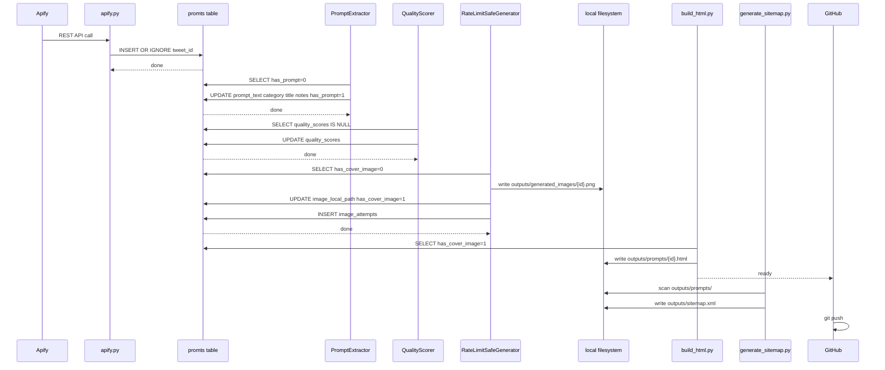
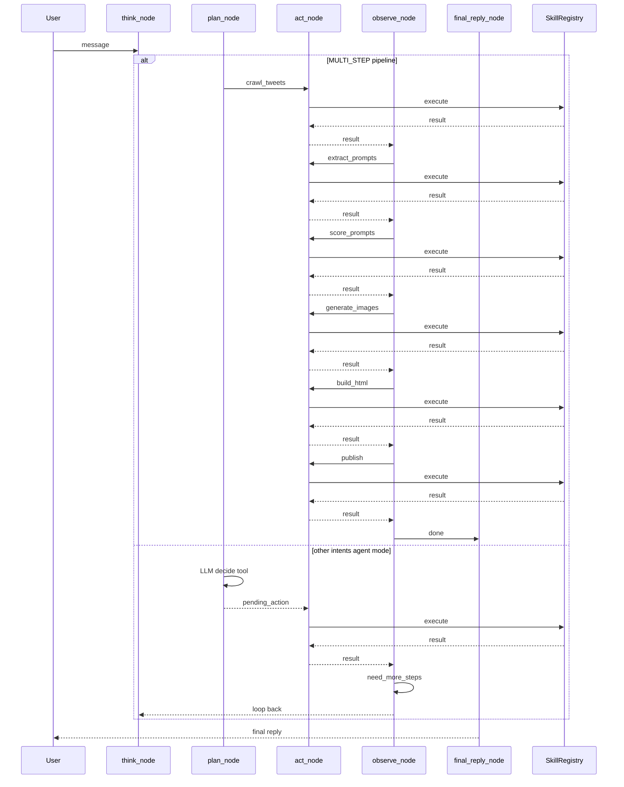
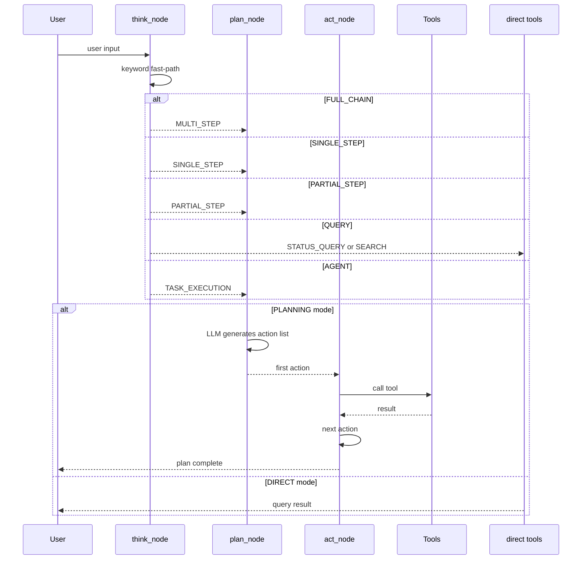

# Sparki-Veo-Station 项目全景文档

> 本文档是项目的事实来源，涵盖架构、数据流动、工具链、数据库表、关键 Prompt。
> 适用版本：V3.2

---

## 一、项目定位

Sparki-Veo-Station 是 Sparki（AI 视频生成 Agent）的**内容运营工具**：
- 爬取 X.com 上的 Veo/Gemini 生成 Prompt
- 提取 → 分类 → 打分 → 生成封面图 → 发布为 SEO 落地页
- 目标域名：**veo.sparki.io**

---

## 二、工具链全景

| 工具 | 文件 | 功能简述 |
|---|---|---|
| Apify 爬虫 | `src/crawler/apify.py` | 调用 Apify Actor `nfp1fpt5gUlBwPcor` REST API，按关键词抓 Tweet |
| Tweet 质检器 | `src/worker/extractor.py` | 内容过滤门（`veo` 关键词 + ≥15 词）+ is_prompt 判断 |
| Prompt 提取器 | `src/worker/extractor.py` | 三轮 LLM 提取：初判 → 复查 → 结构化修复 |
| Prompt 分类器 | `src/worker/extractor.py` | LLM 自由输出分类名（当前 19 类，混乱） |
| 封面图生成器 | `src/image_gen/client.py` + `generator.py` | Gemini 多模型 fallback，2s 间隔，速率限制保护 |
| 封面图风格系统 | `src/image_gen/style.py` | `build_image_prompt()` — 按 category 注入学风格关键字 |
| HTML 主页更新器 | `scripts/build_html.py` | 渲染 `outputs/index.html` |
| HTML 详情页生成器 | `scripts/build_html.py` | 生成 `outputs/prompts/{tweet_id}.html`（1+N 页面） |
| 图片同步器 | `scripts/build_html.py` → `_sync_images_to_flat_dir()` | GCS（可选）→ 本地，或直接本地复制 |
| Sitemap 生成器 | `scripts/generate_sitemap.py` | 扫描 `outputs/prompts/*.html` 实时生成 `outputs/sitemap.xml` |
| GitHub 推送器 | `src/agent/skills/core_tools.py` → `tool_publish()` | `build_html` + `git add` + `git push origin gh-pages` |
| Embedding 生成器 | `src/agent/memory/embedding.py` | `gemini-embedding-exp-03-07` 3072 维向量，cosine 相似度 |
| 语义检索器 | `src/agent/skills/core_tools.py` → `tool_search_prompts()` | 调用 `embedding.search_prompts()` |
| 意图识别器 | `src/agent/nodes/think_node.py` | 关键词 fast-path + LLM fallback，输出 IntentType |
| 任务规划器 | `src/agent/nodes/plan_node.py` | 规则判断 SEARCH/CHITCHAT/MULTI_STEP，LLM 决策其他 |
| 执行器 | `src/agent/nodes/act_node.py` | 通过 SkillRegistry 执行工具，记录 ReAct Step |
| 结果评估器 | `src/agent/nodes/observe_node.py` | 规则相接续或 LLM 判断是否继续 |
| 任务历史管理器 | `src/memory/schema.py` | `scrape_runs` / `task_history` / `conversation_history` 表 |

---

## 三、数据流动路径（V3.3 目标架构）



---

## 四、执行时序图（V3.2 ReAct Agent 模式）



---

## 四-B、Plan & Execute 扩展架构



### Extended scenarios

| User input | Intent | Planner output | Executor behavior |
|---|---|---|---|
| 全程跑一遍 | MULTI_STEP | 6 action sequence | auto chain all |
| 只跑 extract | SINGLE_STEP | 1 action | stop after 1 |
| 跑 extract + score | PARTIAL_STEP | 2 actions | stop after 2 |
| 池子里 pending 有多少 | STATUS_QUERY | no planning | pool_status directly |
| 搜索科幻 prompt | SEARCH | no planning | search_prompts directly |
| 帮我生成 10 张图 | TASK_EXECUTION | 1 action | execute generate_images |

**Key design points**:
- SINGLE_STEP and PARTIAL_STEP identified by keyword in think_node, no LLM planning needed
- STATUS_QUERY and SEARCH bypass Planner, route directly to tool
- plan_node only handles TASK_EXECUTION (LLM-driven tool selection)
- Status queries do not write to task_history

### Two-mode comparison

| | Pipeline (Plan & Execute) | Agent mode (ReAct) |
|---|---|---|
| Planning scope | all 6 actions at once | one step at a time |
| Loop control | observe_node auto-chains | observe_node checks need_more_steps |
| Flexibility | low (fixed order) | high (adjusts per result) |
| Triggered by | 全程/一键/跑一遍 | specific tasks |

---

## 五、数据库表总览（V3.2 → V3.3 演进中）

> 定义文件：`src/memory/schema.py`
> 目标版本：合并为 2 张主表 + 1 张辅助表

### 5.1 合并方案：3 → 2 张主表

**当前表结构（问题版）**：tweets + prompts 大量数据冗余，images 表本质是生成日志

**合并后表结构（目标版）**：

| 表名 | 用途 | 关键字段 |
|---|---|---|
| `prompts`（合并后） | **唯一主表**，含原始 Tweet 数据 + prompt + 状态 flag | tweet_id, url, text, author, likes/view/retweet/reply, **has_raw/has_prompt/has_image**, prompt_text, category, title, notes, quality_scores, image_local_path |
| `image_attempts` | 封面图生成日志（retry 追踪） | prompt_id, attempt_index, model_used, status, error_message, generated_at |
| `scrape_runs` | 批次运行记录 | run_id, phase, status, total_tweets/prompts/images, cost |
| `queries` | 关键词维度漏斗 | keyword, tweets_raw/filtered, prompts_extracted, qualified, yield_rate |
| `conversation_history` | 工具调用流水 | role, content, tool_name, tool_args, created_at |
| `task_history` | ReAct 任务归档 | description, steps_json, result_summary, created_at, completed_at |
| `user_preferences` | 用户偏好 KV | key, value, updated_at |
| `keyword_yields` | 关键词效果表 | keyword, raw/filtered/extracted/qualified counts, yield_score |
| `keyword_suggestions` | 待审核关键词建议 | suggested_keyword, reason, status |
| `approved_keywords` | 已批准关键词 | keyword (PK), source, approved_at, note |

### 5.2 状态机设计（3 个布尔 Flag）

```
tweets 表（合并后）
├── has_raw_tweet  : 1 = 已爬取（Tweet 原始数据到位）
├── has_prompt     : 1 = 已提取（prompt_text / category / title / notes 到位）
└── has_cover_image: 1 = 已生成封面图（image_local_path 到位）
```

**状态流转**：

| has_raw | has_prompt | has_image | 状态 | 触发动作 |
|---|---|---|---|---|
| 0 | — | — | 待爬取 | crawl_tweets |
| 1 | 0 | — | 待提取 | extract_prompts |
| 1 | 1 | 0 | 待生图 | score_prompts → generate_images |
| 1 | 1 | 1 | 待发布 | build_html → publish |

**状态判断不再依赖 NULL 值推断**，直接用 Flag = 1。

### 5.3 images 表 → image_attempts 表（精简为生成日志）

| 字段 | 说明 |
|---|---|
| `id` | PK |
| `prompt_id` | FK → 合并后的 prompts 表 |
| `attempt_index` | 第几次生成尝试（retry 计数） |
| `model_used` | 使用的模型名 |
| `status` | `success` / `failed` |
| `error_message` | 失败原因 |
| `generated_at` | 时间戳 |

---

## 六、关键 Prompt 位置

| Prompt 名称 | 文件 | 用途 |
|---|---|---|
| **提取系统**（三阶段） | `prompts/extraction/01_extraction_system.md` | is_prompt 判断 + category/title/prompt_text/notes |
| **打分系统** | `prompts/scoring/01_scoring_system.md` | 四维打分（spec/vis/nov/gen） |
| **封面图生成** | `prompts/image_generation/01_cover_image.md` | build_image_prompt 模板（嵌入 `style.py`） |
| **Skill 描述（LLM可见）** | `prompts/skill_descriptions/01_core_tools.md` | 18 个 skill 的 schema，LLM 选工具时参考 |
| think_node | `src/agent/nodes/think_node.py`（代码内） | 意图分类 + 思考链 |
| plan_node | `src/agent/nodes/plan_node.py`（代码内） | 工具选择或直接回复 |
| observe_node | `src/agent/nodes/observe_node.py`（代码内） | 结果评估 + 循环控制 |

---

## 七、配置体系

| 文件 | 控制范围 |
|---|---|
| `configs/crawler.yaml` | Apify Actor ID、scroll_budget、timeout、proxy、concurrency、max_cost |
| `configs/engagement.yaml` | min_likes/followers/views、max_tweets_per_query（默认全 0） |
| `configs/gemini.yaml` | GCS bucket、image_models、concurrency、retry、**style keywords per category** |
| `configs/llm.yaml` | Provider（gemini/minimax）、API base/key、model、timeouts、concurrency |
| `configs/quality.yaml` | 打分权重 spec 0.25 / vis 0.30 / nov 0.20 / gen 0.25 + 阈值 |
| `configs/agent.yaml` | Agent 模型、max_steps、embedding 模型 |

---

## 八、Skill 注册清单

> 文件：`src/agent/skills/core_tools.py`（`register_core_tools()`）+ `keyword_tools.py`

| # | 名称 | category | 核心功能 |
|---|---|---|---|
| 1 | `crawl_tweets` | data_collection | Apify API → tweets 表 |
| 2 | `extract_prompts` | data_collection | LLM 提取 tweet→prompt |
| 3 | `score_prompts` | data_collection | 四维质量打分 |
| 4 | `sync_images` | ai_generation | 本地 generated_images/ 同步（可选，GCS 中转已废弃） |
| 5 | `build_html` | web_maintenance | DB → index.html + 详情页 |
| 6 | `pool_status` | system | 查询 prompt 池状态 |
| 7 | `search_prompts` | system | 语义 embedding 检索 |
| 8 | `generate_images` | ai_generation | 封面图生成（串行安全） |
| 9 | `retry_failed` | ai_generation | 重试失败的图片生成 |
| 10 | `publish` | web_maintenance | HTML 构建 + git push |
| 11 | `show_history` | memory | 查看任务历史 |
| 12 | `save_preference` | memory | 保存用户偏好 |
| 13 | `get_preference` | memory | 读取用户偏好 |
| 14 | `analyze_keyword_yield` | data_collection | 关键词效果分析 |
| 15 | `generate_keyword_suggestions` | data_collection | AI 建议新关键词 |
| 16 | `confirm_keywords` | data_collection | 审批关键词建议 |
| 17 | `show_approved_keywords` | data_collection | 列出已批准关键词 |
| 18 | `crawl_with_keywords` | data_collection | 按指定关键词爬取 |

---

## 九、当前分类体系问题

**现状**：LLM 自由输出分类，产生了 19 个类别，其中大量是旧命名：
- 混乱类：`Action/Suspense`、`Character Design`、`Template/Tutorial`、`Text-to-Video`
- LLM 自创：`cinematic-scene`（36条）、`sci-fi-fantasy`（37条）— 占了全量 73 条
- 你的目标 9 类（`animation`/`sci-fi`/`product`/`urban`/`nature`/`historical`/`fantasy`/`film`/`animal`）完全未被使用

**修复方案**（9+1 分类体系）：
```
预设 9 类：animation / sci-fi / product / urban / nature / historical / fantasy / film / animal
兜底 1 类：other
流程：LLM 匹配 → 预设分类；不匹配 → 'other'
       批量结束后 → 归类审查 skill → 人工确认 → 更新分类 + 调整分类器
```

---

## 十、图片文字问题根因

**根因**：`build_image_prompt()` 的构造：
```
Prompt title: {title}   ← 直接把 title 字段塞给模型（废弃）
Prompt text: {prompt_text}
```
`title` 字段常含 `SHOT TYPE: [wide/medium/...]` 这种结构化元文字，模型在生成封面图时把它当作语义内容渲染进画面。

**修复**：`title` 字段不再进入图片生成 prompt；只用 `style_keywords`（学风格关键字）和 `category` 引导视觉方向。

---

## 十一、串行生图改进（直接本地存储，废除 GCS 中转）

**当前**：每批 8~10 张图全部生成完 → 统一写 DB；经过 GCS 中转
**期望**：每生成完 1 张 → 立即写 DB（`image_status='done'` + `image_local_path`）

**GCS 中转废除**：图片直接保存到 `outputs/generated_images/{id}.png`，不再上传 GCS。`image_gcs_url` 字段废弃，改为 `image_local_path`（本地相对路径）。

**改动位置**：`src/image_gen/generator.py` — `RateLimitSafeGenerator.generate_batch()` 内每完成一个 result 就写入本地文件 + 更新 DB，不再经过 GCS。

---

## 十二、操作结构化记录

所有工具调用已通过 `conversation_history` 表记录（role=tool）。

新增需求字段：
| 字段 | 表 | 用途 |
|---|---|---|
| `tool_params` | `conversation_history` | JSON，记录每次调用的完整入参 |
| `phase` | `scrape_runs` | 当前所处阶段（crawl/extract/score/generate/sync/build/publish） |
| `批次漏斗` | `queries` 表 | 已在 keyword维度 记录 raw/filtered/extracted/qualified counts |

---

*文档版本：V3.3 目标版 · 2026-05-27*